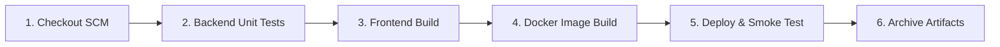

# Agri AI — Jenkins CI/CD Pipeline Guide

This project includes a production-ready **Jenkins CI/CD Pipeline** defined in the root [Jenkinsfile](Jenkinsfile).

---

## 🚀 Pipeline Architecture & Stages

The pipeline automatically orchestrates:



1. **Stage 1: Checkout SCM**  
   Clones the repository from GitHub (`https://github.com/sreethan05/Agri.git`) on branch `main`.
2. **Stage 2: Backend Automated Tests**  
   Prepares a clean Python environment, installs `backend/requirements.txt`, and runs the automated test suite ([backend/tests/test_api.py](backend/tests/test_api.py)) verifying API health, disease classes, weather logic, mandi market rates, and authentication.
3. **Stage 3: Frontend Build & Validation**  
   Installs Node.js dependencies and compiles the React + Vite frontend into optimized static production assets (`npm run build`).
4. **Stage 4: Docker Container Build**  
   Constructs container images for both the FastAPI backend (`Dockerfile.backend`) and the Nginx-hosted frontend (`Dockerfile.frontend`) via `docker-compose`.
5. **Stage 5: Deploy & Health Smoke Test**  
   Spins up the containers locally in detached mode, performs a smoke test by hitting `http://localhost:8000/health`, and tears down the testing container set.
6. **Stage 6: Artifact Archiving**  
   Archives the compiled frontend distribution bundle (`frontend/dist/**`) directly within the Jenkins job build history for direct download and deployment.

---

## 🛠️ How to Run Jenkins Locally (Quick Setup)

You can run Jenkins on your machine using Docker with a single command:

### 1. Start Jenkins via Docker
Open PowerShell or Terminal and run:

```powershell
docker run -d `
  --name jenkins `
  -p 8080:8080 `
  -p 50000:50000 `
  -v jenkins_home:/var/jenkins_home `
  -v /var/run/docker.sock:/var/run/docker.sock `
  jenkins/jenkins:lts
```

### 2. Unlock Jenkins
1. Open your browser and navigate to: **`http://localhost:8080`**
2. When prompted for the initial administrator password, retrieve it by running:
   ```powershell
   docker exec jenkins cat /var/jenkins_home/secrets/initialAdminPassword
   ```
3. Paste the password and click **Continue**.
4. Select **Install suggested plugins**.
5. Create your admin user account (e.g. `admin` / `password123`) and complete the setup.

---

## 📋 How to Create and Run the Agri Pipeline Job

1. On the Jenkins dashboard, click **"New Item"** (in the left sidebar).
2. Enter the item name: **`Agri-CI-CD`**
3. Select **"Pipeline"** and click **OK**.
4. Scroll down to the **Pipeline** section:
   - In **Definition**, select: **`Pipeline script from SCM`**
   - In **SCM**, select: **`Git`**
   - In **Repository URL**, enter:
     ```text
     https://github.com/sreethan05/Agri.git
     ```
   - In **Branches to build**, enter:
     ```text
     */main
     ```
   - In **Script Path**, verify it is set to:
     ```text
     Jenkinsfile
     ```
5. Click **Save**.

---

## ▶️ Running the Pipeline

1. In your `Agri-CI-CD` project view, click **"Build Now"** in the left menu.
2. Watch the **Stage View** execute in real time:
   - 🟩 Checkout SCM
   - 🟩 Backend Unit & Integration Tests
   - 🟩 Frontend Build & Validation
   - 🟩 Docker Container Build
   - 🟩 Deploy & Health Smoke Test
   - 🟩 Archive Artifacts
3. Click on any stage to view console logs and test results.

---

## 🎓 What to Explain to Your Teacher / Mam

When demonstrating the project, highlight these key points:
- **Continuous Integration (CI)**: Any code change pushed to GitHub automatically triggers automated unit tests (`test_api.py`) and builds the React frontend, ensuring zero regressions or syntax bugs enter production.
- **Continuous Delivery / Deployment (CD)**: The pipeline builds production-grade Docker containers and executes automated container health checks (`/health`) before declaring the build successful.
- **Artifact Management**: Production web bundles are archived per-build for instant rollback and deployment.
